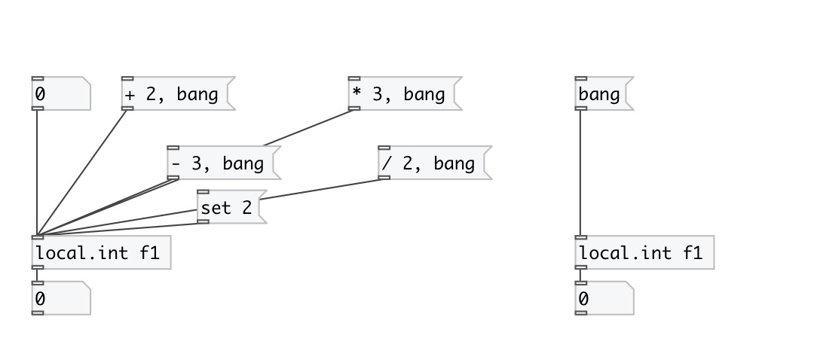

[< reference home](index.html)
---

# local.int

canvas-scoped named integer variable

---

Defines named local integer variable, accessed by name and available only within
            its patch (canvas). Note: it is not accessible even from subpatch.
 

---

---
arguments:

ID: object ID 

---
properties:

@value: current value 

---
see also: 

