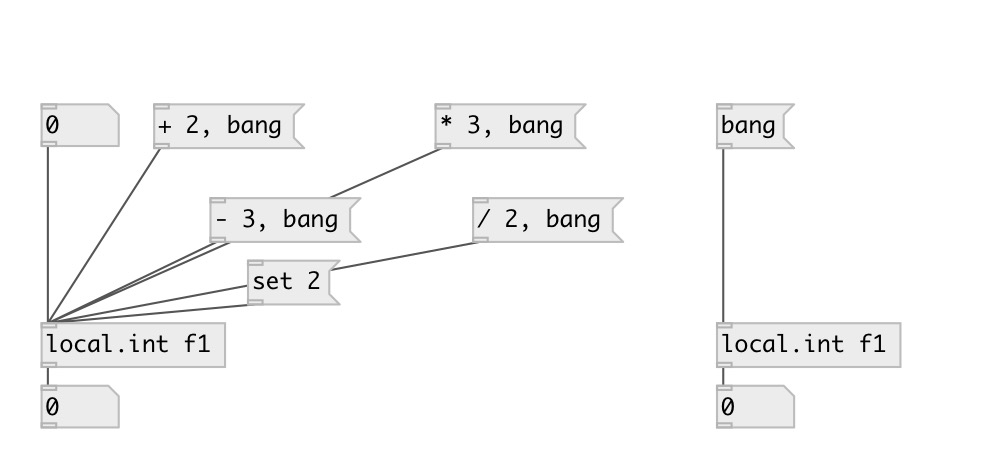

[index](index.html) :: [local](category_local.html)
---

# local.int

###### canvas-scoped named integer variable

*available since version:* 0.1

---

## information
Defines named local integer variable, accessed by name and available only within
            its patch (canvas). Note: it is not accessible even from subpatch.

## arguments:

* **ID**
object ID 
__type:__ symbol 

## methods:

* **set**
sets new value without output 

* **+**
add to int, no output 

* **-**
substruct from int, no output 

* *****
multiply to, no output 

* **/**
divide by, no output 

## properties:

* **@value** (readonly)
Get current value 
__type:__ int 
__default:__ 0 

## inlets:

* output value 
__type:__ control 

## outlets:

* integer output
__type:__ control 

## keywords:

[int](keywords/int.html)
[local](keywords/local.html)

**See also:**
[\[local.float\]](local.float.html)
[\[local.list\]](local.list.html)
[\[global.int\]](global.int.html)

**Authors:** Serge Poltavsky

**License:** GPL3 or later

