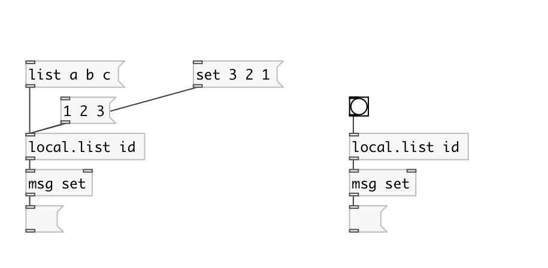
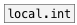

[< reference home](index.html)
---

# local.list

local named list object

---

Defines local scope list variable, accessed by ID name and available only within
            its patch (canvas).
 

---

---
arguments:

ID: object ID 

---
properties:

@empty: 1 if list is
            empty, otherwise 0 
@size: number of
            elements in list 

---
see also: 

