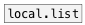

# local.mlist

```


[\(1 2 3 \(a b c\)\), bang( [bang(
|                           |
[ml]                        [local.mlist l1]
|                           |
[local.mlist l1]            [ui.display @display_type=1]
|
[ui.display @display_type=1]

            
```
---
arguments:

ID: object ID<br>

---
properties:

@empty: 1 if list is
            empty, otherwise 0<br>
@size: number of
            elements in list<br>

see also:<br>


