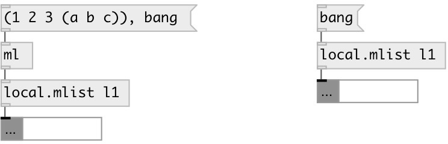

[index](index.html) :: [local](category_local.html)
---

# local.mlist

###### local named mlist object

*available since version:* 0.6

---

## information
Defines local scope mlist variable, accessed by ID name and available only within its patch (canvas).

## arguments:

* **ID**
object ID 
_type:_ symbol 

## methods:

* **append**
adds values to the end of the list 
  __parameters:__
  - **VAL** appended value 
    type: atom  
    required: True  

* **prepend**
inserts values to the list beginning 
  __parameters:__
  - **VAL** prepended value 
    type: atom  
    required: True  

* **insert**
inserts values to the specified position 
  __parameters:__
  - **IDX** insert position 
    type: int  
    required: True  

  - **VAL** value 
    type: atom  
    required: True  

* **fill**
fills with specified value 
  __parameters:__
  - **VAL** fill value 
    type: atom  
    required: True  

* **reverse**
reverses list 

* **choose**
choose random element in list and output it 

* **shuffle**
put elements in random order 

* **sort**
sorts list 

* **clear**
removes all list elements 

* **pop**
removes last list element 

* **remove**
removes specified element 
  __parameters:__
  - **IDX** element index 
    type: int  
    required: True  

* **set**
sets new list without output 
  __parameters:__
  - **LIST** new list content 
    type: list  
    required: True  

* **dump**
dump object info to Pd window 

* **(....)**
sets new list without output 

## properties:

* **@empty** (readonly)
Get 1 if list is empty, otherwise 0 
_type:_ int 
_enum:_ 0, 1 
_default:_ 1 

* **@size** (readonly)
Get number of elements in list 
_type:_ int 
_min value:_ 0 
_default:_ 0 

## inlets:

* output list content 
_type:_ control

## outlets:

* mlist output 
_type:_ control

## keywords:

[mlist](keywords/mlist.html)
[local](keywords/local.html)
[global](keywords/global.html)

**See also:**
[\[data.mlist\]](data.mlist.html)
[\[local.list\]](local.list.html)

**Authors:** Serge Poltavsky

**License:** GPL3 or later

