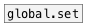

[< reference home](ceammc_lib.html)
---

# local.set


local named set object

---

Defines local scope set variable, accessed by ID name<br>


---


```

                     
[B]   [1 2 3( [F] [clear(    [bang(
|     |       |   |          |
|     |       |   |          |
|     |       |   |          |
[local.set      s1]          [local.set s1]
|                            |
[ui.display @display_type=1] [ui.display @display_type=1]

            
```

---
arguments:

ID: object ID<br>

---
properties:

@empty: 1 if list is
            empty, otherwise 0<br>
@size: number of
            elements in list<br>

---
see also:<br>
[](data.set.html)
[](global.set.html)
