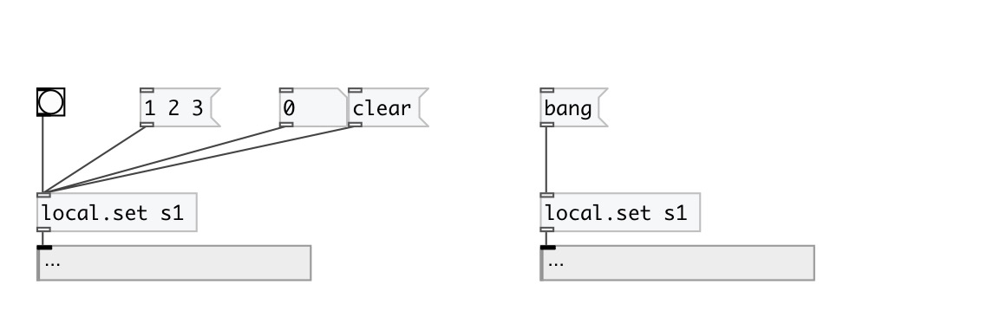

[< reference home](index.html)
---

# local.set

local named set object

---

Defines local scope set variable, accessed by ID name
 

---

---
arguments:

ID: object ID 

---
properties:

@empty: 1 if list is
            empty, otherwise 0 
@size: number of
            elements in list 

---
see also: 

