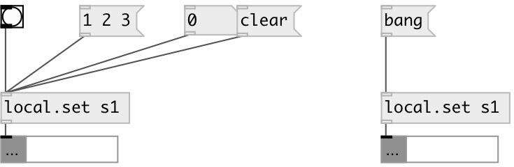

[index](index.html) :: [local](category_local.html)
---

# local.set

###### local named set object

*available since version:* 0.6

---

## information
Defines local scope set variable, accessed by ID name

## arguments:

* **ID**
object ID 
_type:_ symbol 

## methods:

* **add**
add values to the set 
  __parameters:__
  - **VAL** added values 
    type: list  
    required: True  

* **clear**
removes all set elements 

* **remove**
remove elements from the set 
  __parameters:__
  - **VAL** elements 
    type: list  
    required: True  

* **set**
sets new set content without output 
  __parameters:__
  - **LIST** new set content 
    type: list  
    required: True  

* **choose**
choose random element and output it 

## properties:

* **@empty** (readonly)
Get 1 if list is empty, otherwise 0 
_type:_ bool 
_default:_ 1 

* **@size** (readonly)
Get number of elements in list 
_type:_ int 
_min value:_ 0 
_default:_ 0 

## inlets:

* output set content 
_type:_ control

## outlets:

* set output 
_type:_ control

## keywords:

[set](keywords/set.html)
[local](keywords/local.html)
[global](keywords/global.html)

**See also:**
[\[data.set\]](data.set.html)
[\[global.set\]](global.set.html)

**Authors:** Serge Poltavsky

**License:** GPL3 or later

