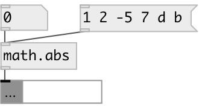

[index](index.html) :: [math](category_math.html)
---

# math.abs

###### absolute value function

*available since version:* 0.1

---

## information
The abs() function computes the absolute value of the float input.

## inlets:

* input value 
_type:_ control

## outlets:

* result value 
_type:_ control

## keywords:

[math](keywords/math.html)
[abs](keywords/abs.html)

**See also:**
[\[math.floor\]](math.floor.html)

**Authors:** Serge Poltavsky

**License:** GPL3 or later

