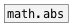

# math.abs~

```


[bang(                        [array mabs {w=200,h=200}]
|
[plot.linspace~ -1 1]
|             ^|
[math.abs~]    |
|              |.
[array.plot~ mabs @yauto 1]

            
```
---
arguments:


---
properties:


see also:<br>

