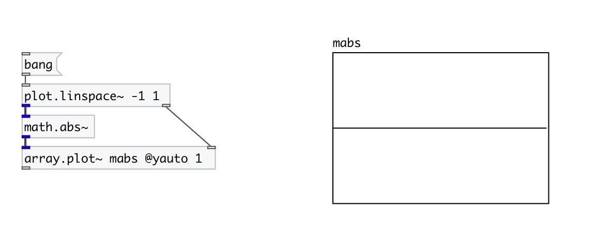

[< reference home](index.html)
---

# math.abs~

absolute value function for signals

---

The abs() function computes the absolute value of the float input.
 

---

---
arguments:

---
properties:

---
see also: 

