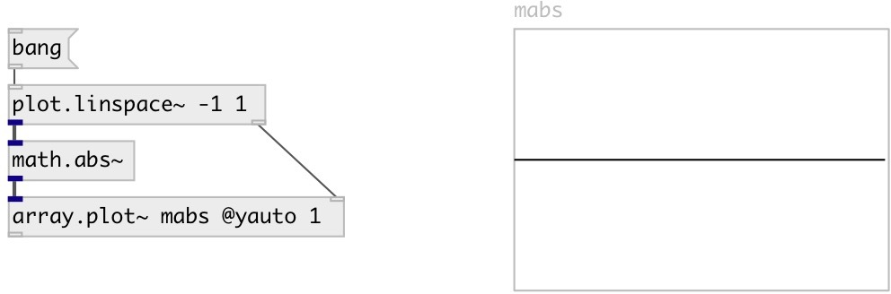

[index](index.html) :: [math](category_math.html)
---

# math.abs~

###### absolute value function for signals

*available since version:* 0.9

---

## information
The abs() function computes the absolute value of the float input.

## inlets:

* input signal 
_type:_ audio

## outlets:

* output signal 
_type:_ audio

## keywords:

[math](keywords/math.html)
[abs](keywords/abs.html)

**See also:**
[\[math.abs\]](math.abs.html)

**Authors:** Serge Poltavsky

**License:** GPL3 or later

