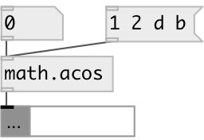

[index](index.html) :: [math](category_math.html)
---

# math.acos

###### arc cosine function

*available since version:* 0.1

---

## information
The acos() function computes the principle value of the arc cosine of input value. The result is in the range [0, pi]. Special values: acos(1) returns +0. acos(x) returns a NAN.

## inlets:

* input value 
_type:_ control

## outlets:

* result value 
_type:_ control

## keywords:

[math](keywords/math.html)
[acos](keywords/acos.html)

**See also:**
[\[math.sin\]](math.sin.html)
[\[math.cos\]](math.cos.html)
[\[math.tan\]](math.tan.html)
[\[math.asin\]](math.asin.html)

**Authors:** Serge Poltavsky

**License:** GPL3 or later

