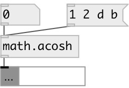

[index](index.html) :: [math](category_math.html)
---

# math.acosh

###### inverse hyperbolic cosine function

*available since version:* 0.1

---

## information
The acosh() function computes the principle value of the inverse hyperbolic cosine
            of input value. The result is in the range [0, +infinity].
Special values:
acosh(1) returns +0.
acosh(x) returns a NAN.
acosh(+infinity) returns +infinity.

## inlets:

* input value 
_type:_ control

## outlets:

* result value 
_type:_ control

## keywords:

[math](keywords/math.html)
[acosh](keywords/acosh.html)

**See also:**
[\[math.asinh\]](math.asinh.html)
[\[math.atanh\]](math.atanh.html)
[\[math.exp\]](math.exp.html)

**Authors:** Serge Poltavsky

**License:** GPL3 or later

