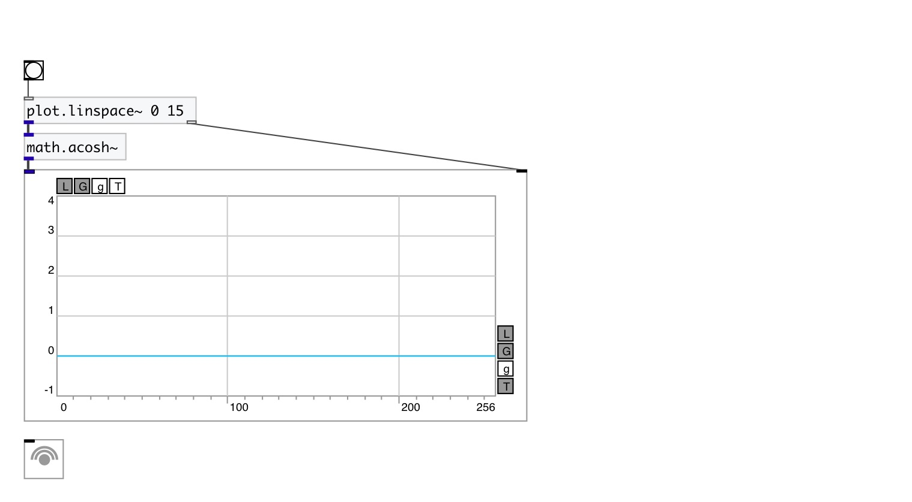

[< reference home](index.html)
---

# math.acosh~

hyperbolic arc cosine for signals

---

Outputs the principle value of the hyperbolic arc cosine of input signal. Input
            signal expected to be &gt;= 1, otherwise output will be NAN
 

---

---
arguments:

---
properties:

---
see also: 

