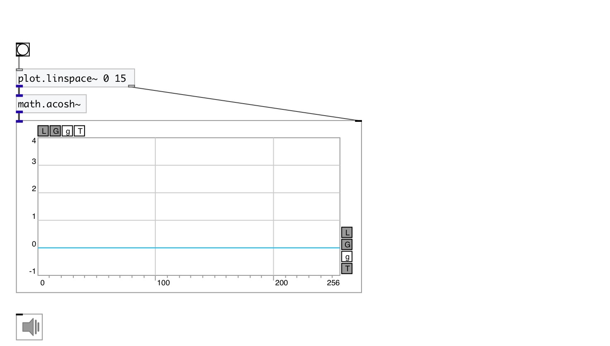

[index](index.html) :: [math](category_math.html)
---

# math.acosh~

###### hyperbolic arc cosine for signals

*available since version:* 0.9

---

## information
Outputs the principle value of the hyperbolic arc cosine of input signal. Input signal expected to be &gt;= 1, otherwise output will be NAN

## inlets:

* input signal 
_type:_ audio

## outlets:

* result signal 
_type:_ audio

## keywords:

[math](keywords/math.html)
[hyperbolic](keywords/hyperbolic.html)
[arc](keywords/arc.html)
[cosine](keywords/cosine.html)

**See also:**
[\[math.cosh~\]](math.cosh~.html)
[\[math.acosh\]](math.acosh.html)

**Authors:** Serge Poltavsky

**License:** GPL3 or later

