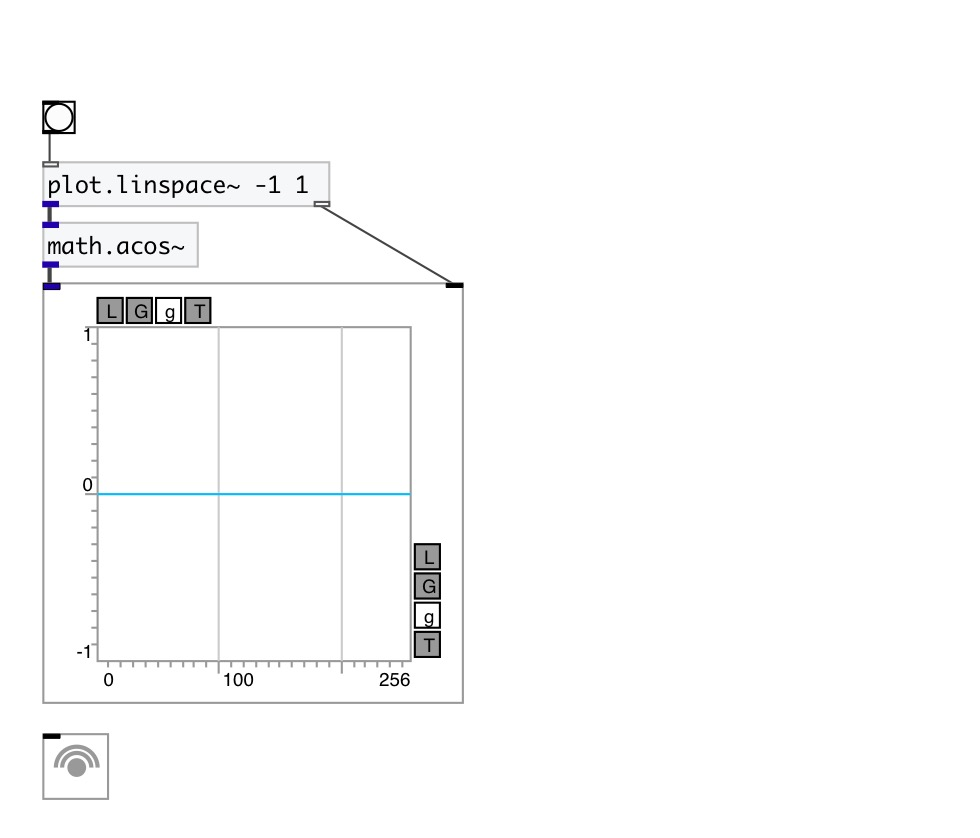

[< reference home](index.html)
---

# math.acos~

arc cosine function for signals

---

Outputs the principle value of the arc cosine of input signal. The result is in
            the range [0, pi]
 

---

---
arguments:

---
properties:

---
see also: 

