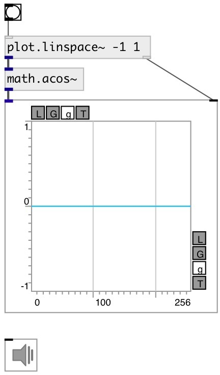

[index](index.html) :: [math](category_math.html)
---

# math.acos~

###### arc cosine function for signals

*available since version:* 0.9

---

## information
Outputs the principle value of the arc cosine of input signal. The result is in
            the range [0, pi]

## inlets:

* input signal 
__type:__ audio 

## outlets:

* result signal
__type:__ audio 

## keywords:

[math](keywords/math.html)
[acos](keywords/acos.html)

**See also:**
[\[math.acos\]](math.acos.html)

**Authors:** Serge Poltavsky

**License:** GPL3 or later

