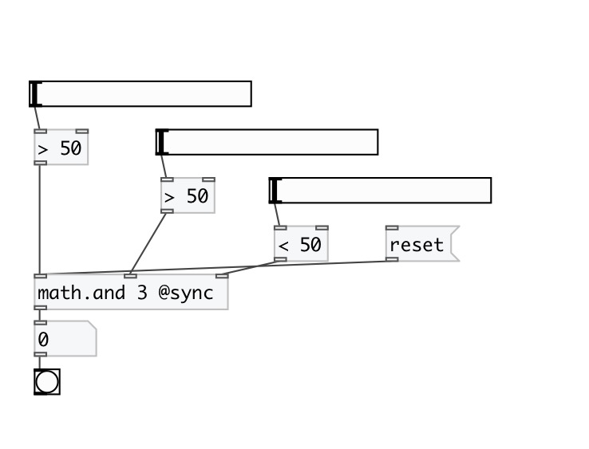
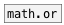

[< reference home](index.html)
---

# math.and

operation AND for multiple arguments

---

 

---

---
arguments:

NUM: number of
            arguments 

---
properties:

@sync: if specified - all inlets are
            &#39;hot&#39; 
@state: internal logic
            state as list of 1 and 0 

---
see also: 

