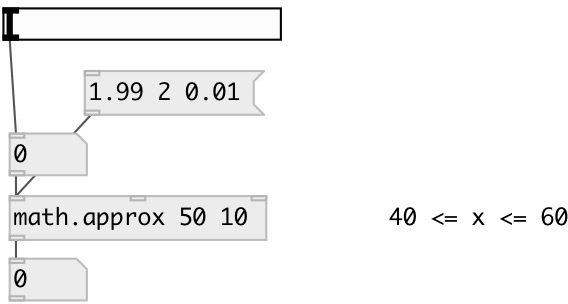

[index](index.html) :: [math](category_math.html)
---

# math.approx
**aliases:** [ceammc/approx], [approx]

###### check if input value approximately equal to pattern

*available since version:* 0.1

---

## information
checks is |x - pattern| &lt;= |epsilon|

## arguments:

* **P**
compare pattern 
_type:_ float 

* **E**
compare epsilon 
_type:_ float 

## properties:

* **@value** 
Get/set compare pattern 
_type:_ float 
_default:_ 0 

* **@epsilon** 
Get/set compare epsilon 
_type:_ float 
_default:_ 0.01 

## inlets:

* input value 
_type:_ control
* pattern value 
_type:_ control
* epsilon 
_type:_ control

## outlets:

* output 1 if input value is approximately equal to pattern, 0 0 otherwise 
_type:_ control

## keywords:

[equal](keywords/equal.html)
[compare](keywords/compare.html)
[approx](keywords/approx.html)

**Authors:** Serge Poltavsky

**License:** GPL3 or later

