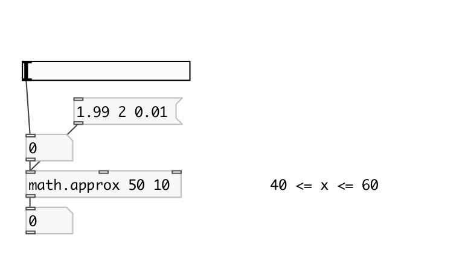

[< reference home](index.html)
---

# math.approx

check if input value approximately equal to pattern

---

checks is |x - pattern| &lt;= |epsilon|
 

---

---
arguments:

P: compare pattern 
E: compare epsilon 

---
properties:

@value: compare pattern 
@epsilon: compare epsilon 

