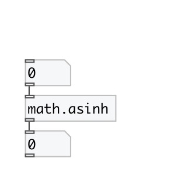

[< reference home](index.html)
---

# math.asinh

inverse hyperbolic sine function

---

The asinh() function computes the inverse hyperbolic sine of the real
            argument
Special values:
asinh(+-0) returns +-0.
asinh(+-infinity) returns +-infinity.
 

---

---
arguments:

---
properties:

---
see also: 

