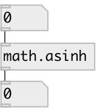

[index](index.html) :: [math](category_math.html)
---

# math.asinh

###### inverse hyperbolic sine function

*available since version:* 0.1

---

## information
The asinh() function computes the inverse hyperbolic sine of the real
            argument
Special values:
asinh(+-0) returns +-0.
asinh(+-infinity) returns +-infinity.

## inlets:

* input value 
_type:_ control

## outlets:

* result value 
_type:_ control

## keywords:

[math](keywords/math.html)
[asinh](keywords/asinh.html)

**See also:**
[\[math.acosh\]](math.acosh.html)
[\[math.atanh\]](math.atanh.html)
[\[math.exp\]](math.exp.html)

**Authors:** Serge Poltavsky

**License:** GPL3 or later

