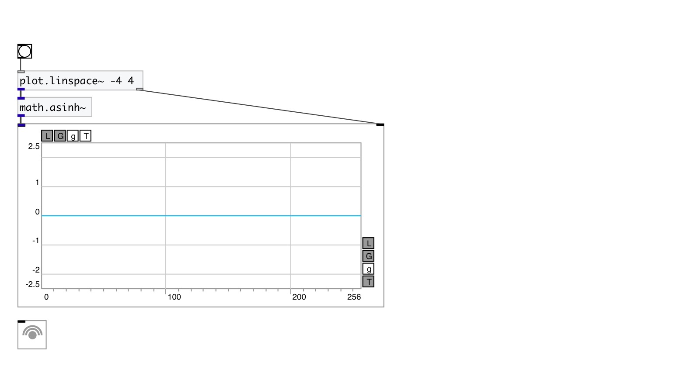

[< reference home](index.html)
---

# math.asinh~

hyperbolic arc sine for signals

---

Outputs the principle value of the hyperbolic arc sine of input signal
 

---

---
arguments:

---
properties:

---
see also: 

