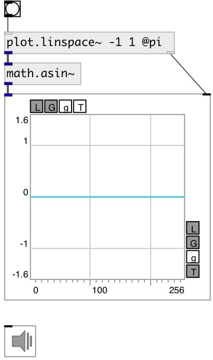

[index](index.html) :: [math](category_math.html)
---

# math.asin~

###### arc sine for signals

*available since version:* 0.9

---

## information
Outputs the principle value of the arc sine of input signal. The result is in the range [-pi/2, +pi/2]

## inlets:

* input signal 
_type:_ audio

## outlets:

* result signal 
_type:_ audio

## keywords:

[math](keywords/math.html)
[asin](keywords/asin.html)

**See also:**
[\[math.asin\]](math.asin.html)
[\[math.acos~\]](math.acos~.html)

**Authors:** Serge Poltavsky

**License:** GPL3 or later

