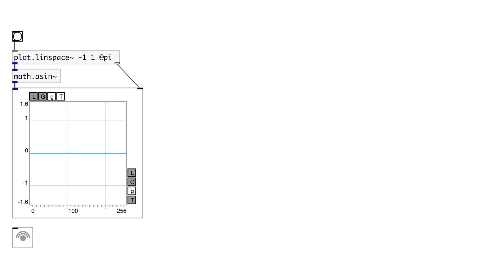

[< reference home](index.html)
---

# math.asin~

arc sine for signals

---

Outputs the principle value of the arc sine of input signal. The result is in the
            range [-pi/2, +pi/2]
 

---

---
arguments:

---
properties:

---
see also: 

