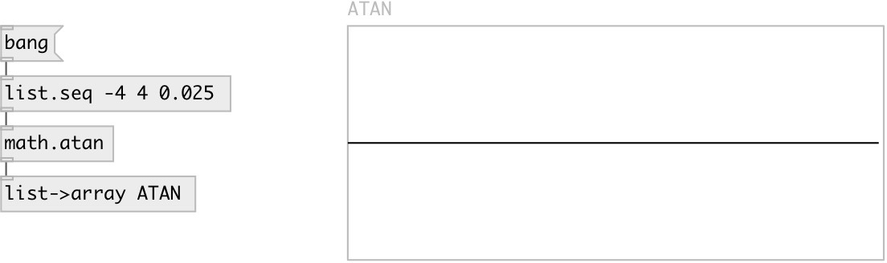

[index](index.html) :: [math](category_math.html)
---

# math.atan

###### arc tangent function

*available since version:* 0.1

---

## information
Outputs the principal value of the arc tangent of input value. The result is in
            the range [-π/2, +π/2].
Special values:
atan(+-0) returns +-0.
atan(+-infinity) returns +-π/2

## inlets:

* input value 
_type:_ control

## outlets:

* result value 
_type:_ control

## keywords:

[math](keywords/math.html)
[atan](keywords/atan.html)

**See also:**
[\[math.acos\]](math.acos.html)
[\[math.asin\]](math.asin.html)
[\[math.cos\]](math.cos.html)

**Authors:** Serge Poltavsky

**License:** GPL3 or later

