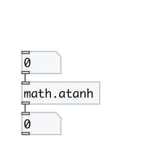

[< reference home](index.html)
---

# math.atanh

inverse hyperbolic tangent function

---

The atanh() function computes the inverse hyperbolic tangent of the real argument
            input value.
Special values:
atanh(+-0) returns +-0.
atanh(+-1) returns +-infinity and raises the &#34;divide-by-zero&#34; floating- point
            exception.
atanh(x) returns a NaN and raises the &#34;invalid&#34; floating-point exception for |x|
            &gt; 1.
 

---

---
arguments:

---
properties:

---
see also: 

