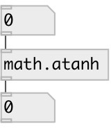

[index](index.html) :: [math](category_math.html)
---

# math.atanh

###### inverse hyperbolic tangent function

*available since version:* 0.1

---

## information
The atanh() function computes the inverse hyperbolic tangent of the real argument input value. Special values: atanh(+-0) returns +-0. atanh(+-1) returns +-infinity and raises the &#34;divide-by-zero&#34; floating- point exception. atanh(x) returns a NaN and raises the &#34;invalid&#34; floating-point exception for |x| &gt; 1.

## inlets:

* input value 
_type:_ control

## outlets:

* result value 
_type:_ control

## keywords:

[math](keywords/math.html)
[atanh](keywords/atanh.html)

**See also:**
[\[math.acosh\]](math.acosh.html)
[\[math.asinh\]](math.asinh.html)
[\[math.exp\]](math.exp.html)

**Authors:** Serge Poltavsky

**License:** GPL3 or later

