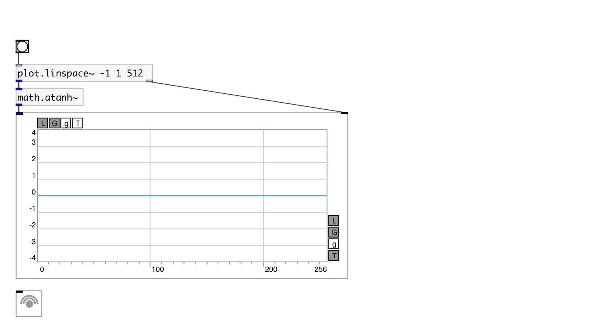

[< reference home](index.html)
---

# math.atanh~

hyperbolic arc tangent for signals

---

Outputs the principle value of the hyperbolic arc tangent of input signal
 

---

---
arguments:

---
properties:

---
see also: 

