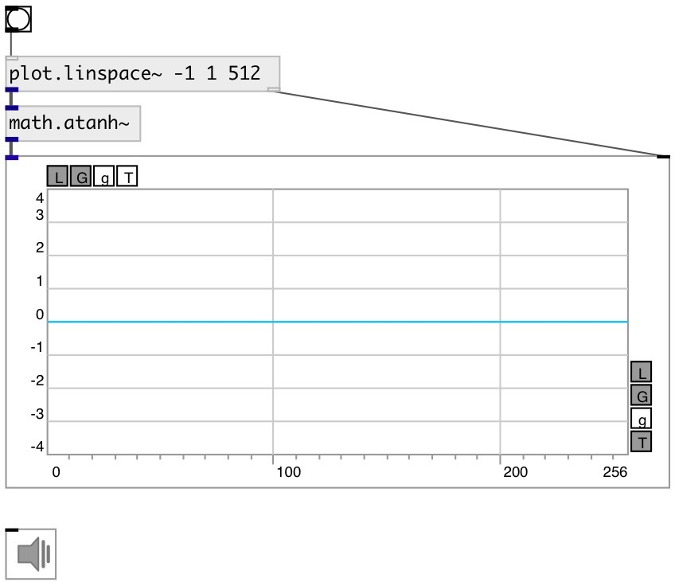

[index](index.html) :: [math](category_math.html)
---

# math.atanh~

###### hyperbolic arc tangent for signals

*available since version:* 0.9

---

## information
Outputs the principle value of the hyperbolic arc tangent of input signal

## inlets:

* input signal 
_type:_ audio

## outlets:

* result signal 
_type:_ audio

## keywords:

[math](keywords/math.html)
[hyperbolic](keywords/hyperbolic.html)
[arc](keywords/arc.html)
[tangent](keywords/tangent.html)

**See also:**
[\[math.sinh~\]](math.sinh~.html)
[\[math.asinh\]](math.asinh.html)

**Authors:** Serge Poltavsky

**License:** GPL3 or later

