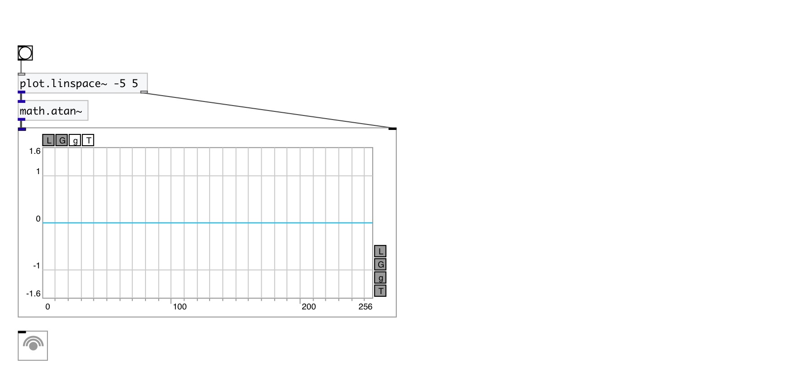

[< reference home](index.html)
---

# math.atan~

arc tangent for signals

---

Outputs arc tangent of input signal. The result is in the range [-π/2, +π/2]
 

---

---
arguments:

---
properties:

---
see also: 

