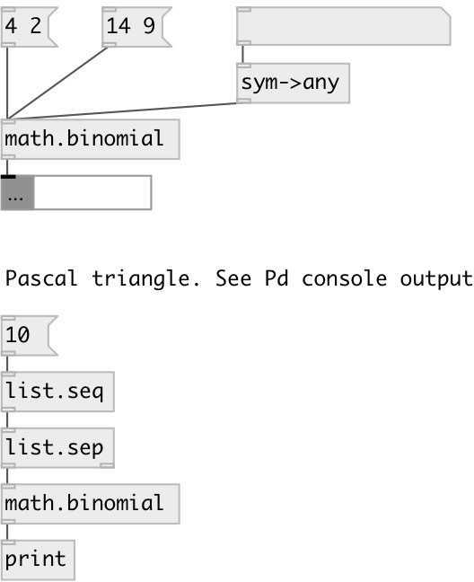

[index](index.html) :: [math](category_math.html)
---

# math.binomial

###### binomial coefficient calculator

*available since version:* 0.9.4

---

## inlets:

* calc all coefficients for given order and output them as
                list 
__type:__ control 

## outlets:

* result value
__type:__ control 

## keywords:

[math](keywords/math.html)
[binomial](keywords/binomial.html)

**Authors:** Serge Poltavsky

**License:** GPL3 or later

