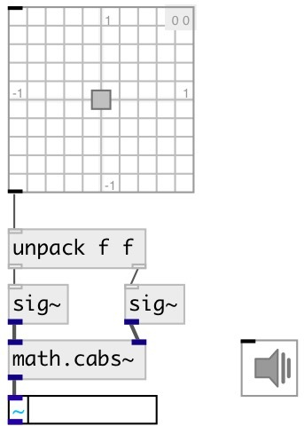

[index](index.html) :: [math](category_math.html)
---

# math.cabs~

###### magnitude of a complex signals

*available since version:* 0.9

---

## inlets:

* real part of input signal 
__type:__ audio 
* imag part of input signal 
__type:__ audio 

## outlets:

* signal magnitude
__type:__ audio 

## keywords:

[math](keywords/math.html)
[complex](keywords/complex.html)
[magnitude](keywords/magnitude.html)
[module](keywords/module.html)

**See also:**
[\[math.carg~\]](math.carg~.html)

**Authors:** Serge Poltavsky

**License:** GPL3 or later

