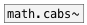

[<<< reference home](ceammc_lib.md)
---

# math.carg~

```


[ui.slider2d @show_grid=1]
|
|
|
|
|
|
|
[unpack f f]
|       ^|
[sig~] [sig~]
|      |.
[math.carg~]  [ui.dsp~]
|
[ui.n~]

            
```
---
phase angle of a complex signals
---
arguments:


---
properties:


---
see also:<br>
[](math.cabs~.md)
