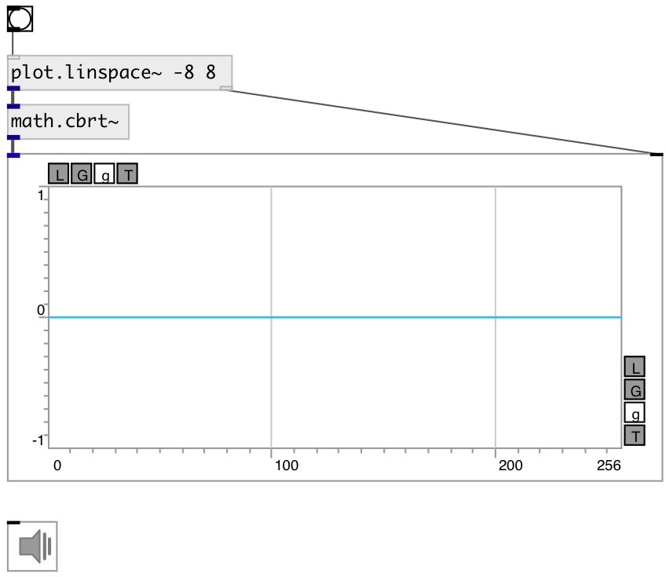

[index](index.html) :: [math](category_math.html)
---

# math.cbrt~

###### cube root function for signals

*available since version:* 0.9

---

## information
Outputs the cube root of input signal
Special values:
cbrt(+-0) returns +-0.
cbrt(+-infinity) returns +-infinity.

## inlets:

* input signal 
__type:__ audio 

## outlets:

* result signal
__type:__ audio 

## keywords:

[math](keywords/math.html)
[cbrt](keywords/cbrt.html)

**See also:**
[\[math.cbrt\]](math.cbrt.html)

**Authors:** Serge Poltavsky

**License:** GPL3 or later

