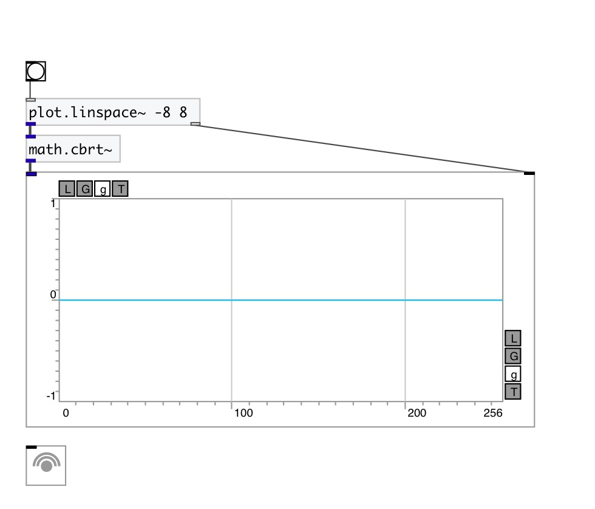

[< reference home](index.html)
---

# math.cbrt~

cube root function for signals

---

Outputs the cube root of input signal
Special values:
cbrt(+-0) returns +-0.
cbrt(+-infinity) returns +-infinity.
 

---

---
arguments:

---
properties:

---
see also: 

