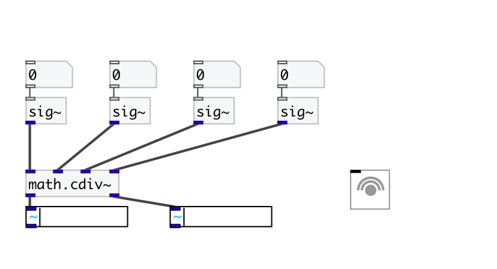

[< reference home](index.html)
---

# math.cdiv~

division of complex signals

---

Calculates for signals (a + bi) / (c + di) = (ac + bd) / (c^2 + d^2) + ((bc - ad)
            / (c^2 + d^2))i
If c + di = 0, outputs 0, as [/~] does
 

---

---
arguments:

---
properties:

---
see also: 

