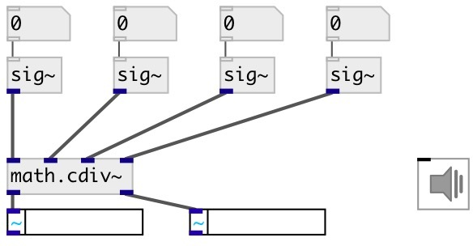

[index](index.html) :: [math](category_math.html)
---

# math.cdiv~
**aliases:** [ceammc/cdiv\~], [cdiv\~]

###### division of complex signals

*available since version:* 0.7

---

## information
Calculates for signals (a + bi) / (c + di) = (ac + bd) / (c^2 + d^2) + ((bc - ad) / (c^2 + d^2))i If c + di = 0, outputs 0, as [/~] does

## inlets:

* real part of input signal1 
_type:_ audio
* imag part of input signal1 
_type:_ audio
* real part of input signal2 
_type:_ audio
* imag part of input signal2 
_type:_ audio

## outlets:

* real part of result 
_type:_ audio
* imag part of result 
_type:_ audio

## keywords:

[math](keywords/math.html)
[complex](keywords/complex.html)
[division](keywords/division.html)

**See also:**
[\[math.cmul~\]](math.cmul~.html)

**Authors:** Serge Poltavsky

**License:** GPL3 or later

