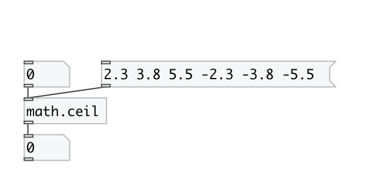

[index](index.html) :: [math](category_math.html)
---

# math.ceil

###### round to smallest integral value not less than input value

*available since version:* 0.1

---

## information
The ceil() function return the smallest integral value greater than or equal to
            input value.
Special values:
ceil(+-0) returns +-0.
ceil(+-infinity) returns +-infinity.

## inlets:

* input value 
__type:__ control 

## outlets:

* result value
__type:__ control 

## keywords:

[math](keywords/math.html)
[ceil](keywords/ceil.html)

**See also:**
[\[math.floor\]](math.floor.html)
[\[math.round\]](math.round.html)
[\[math.trunc\]](math.trunc.html)

**Authors:** Serge Poltavsky

**License:** GPL3 or later

