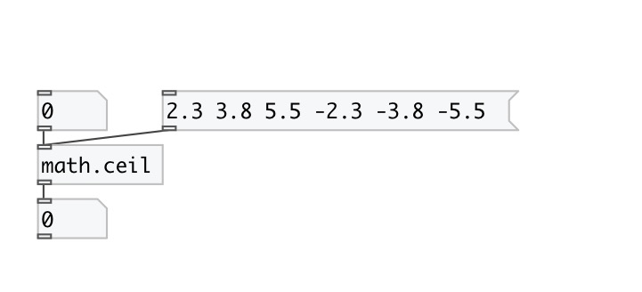

[< reference home](index.html)
---

# math.ceil

round to smallest integral value not less than input value

---

The ceil() function return the smallest integral value greater than or equal to
            input value.
Special values:
ceil(+-0) returns +-0.
ceil(+-infinity) returns +-infinity.
 

---

---
arguments:

---
properties:

---
see also: 

