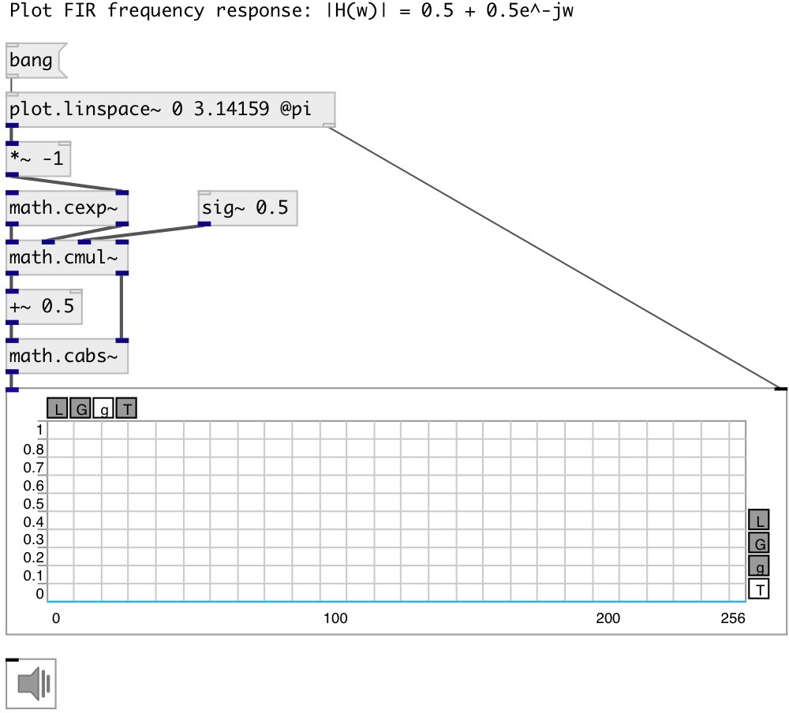

[index](index.html) :: [math](category_math.html)
---

# math.cexp~

###### exponent of a complex signals

*available since version:* 0.9

---

## information
Base-e exponential of complex signal, that is e (Euler&#39;s number, 2.7182818) raised to the complex signal power The complex exponential function e^z for z = x+jy equals e^x (cos(y) + j sin(y)) The exponential function is an entire function in the complex plane and has no branch cuts

## inlets:

* real part of input signal 
_type:_ audio
* imag part of input signal 
_type:_ audio

## outlets:

* real part of result 
_type:_ audio
* imag part of result 
_type:_ audio

## keywords:

[math](keywords/math.html)
[complex](keywords/complex.html)
[magnitude](keywords/magnitude.html)
[module](keywords/module.html)

**See also:**
[\[math.carg~\]](math.carg~.html)

**Authors:** Serge Poltavsky

**License:** GPL3 or later

