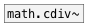

[< reference home](ceammc_lib.html)
---

# math.cmul~


multiplication of complex signals

```


[F]    [F]    [F]    [F]
|      |      |      |
[sig~] [sig~] [sig~] [sig~]
|      |      |      |
|      |      |      |
|      |.     |..    |...
[math.cmul~             ]  [ui.dsp~]
|           ^|
[ui.n~]     [ui.n~]

            
```

---
arguments:


---
properties:


---
see also:<br>
[](math.cdiv~.html)
