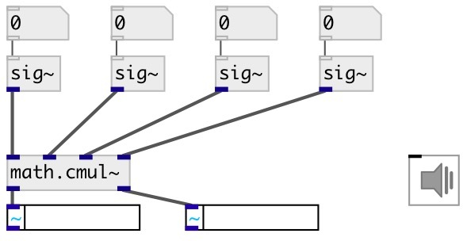

[index](index.html) :: [math](category_math.html)
---

# math.cmul~

###### multiplication of complex signals

*available since version:* 0.7

---

## information
Calculates for signals (a + bi) * (c + di) = (ac - bd) + (ad + bc)i

## inlets:

* real part of input signal1 
_type:_ audio
* imag part of input signal1 
_type:_ audio
* real part of input signal2 
_type:_ audio
* imag part of input signal2 
_type:_ audio

## outlets:

* real part of result 
_type:_ audio
* imag part of result 
_type:_ audio

## keywords:

[math](keywords/math.html)
[complex](keywords/complex.html)
[multiplication](keywords/multiplication.html)

**See also:**
[\[math.cdiv~\]](math.cdiv~.html)

**Authors:** Serge Poltavsky

**License:** GPL3 or later

