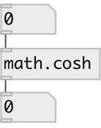

[index](index.html) :: [math](category_math.html)
---

# math.cosh

###### hyperbolic cosine function

*available since version:* 0.1

---

## information
The coshf() function computes the hyperbolic cosine of input value.
Special values:
cosh(+-0) returns 1.
cosh(+-infinity) returns +infinity.

## inlets:

* input value 
__type:__ control 

## outlets:

* result value
__type:__ control 

## keywords:

[math](keywords/math.html)
[cosh](keywords/cosh.html)

**See also:**
[\[math.acos\]](math.acos.html)
[\[math.asin\]](math.asin.html)
[\[math.atan\]](math.atan.html)

**Authors:** Serge Poltavsky

**License:** GPL3 or later

