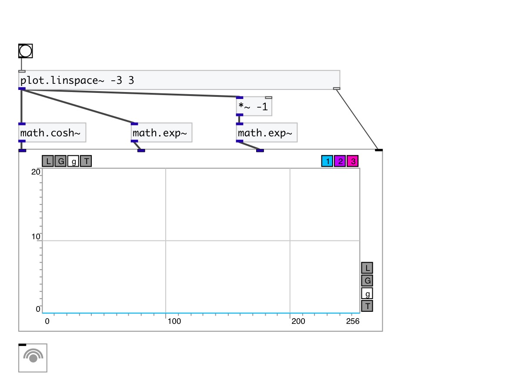

[< reference home](index.html)
---

# math.cosh~

hyperbolic cosine for signals

---

Outputs hyperbolic cosine of input signal
cosh x = (ℯˣ + ℯ⁻ˣ)/2
 

---

---
arguments:

---
properties:

---
see also: 

