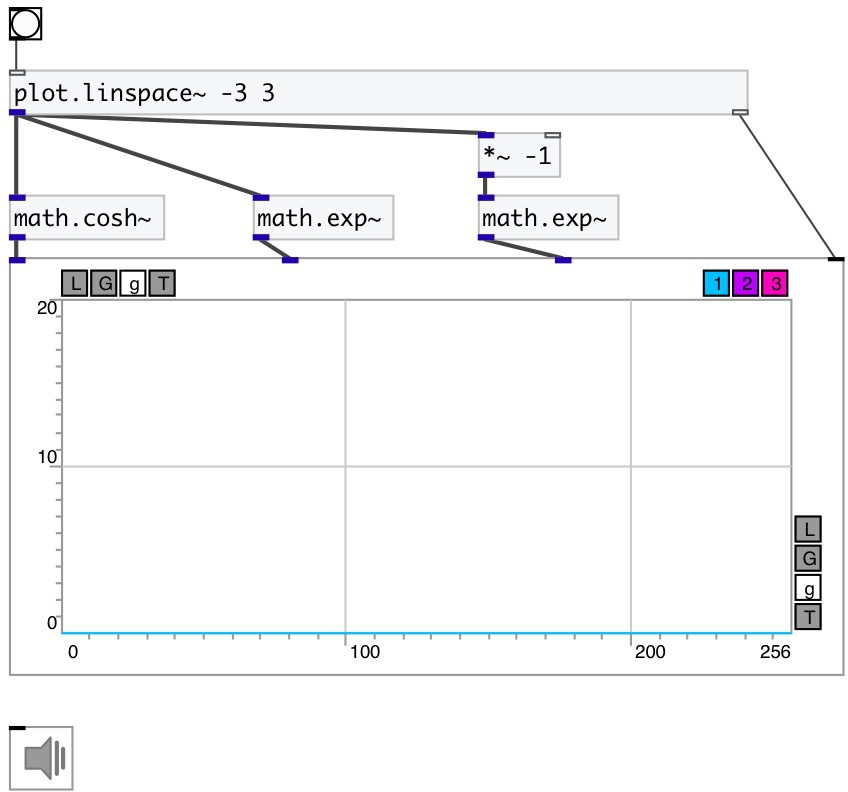

[index](index.html) :: [math](category_math.html)
---

# math.cosh~

###### hyperbolic cosine for signals

*available since version:* 0.9

---

## information
Outputs hyperbolic cosine of input signal
cosh x = (ℯˣ + ℯ⁻ˣ)/2

## inlets:

* input signal 
_type:_ audio

## outlets:

* result signal 
_type:_ audio

## keywords:

[math](keywords/math.html)
[cosh](keywords/cosh.html)
[hyperbolic](keywords/hyperbolic.html)

**See also:**
[\[math.cosh\]](math.cosh.html)
[\[math.acosh~\]](math.acosh~.html)

**Authors:** Serge Poltavsky

**License:** GPL3 or later

