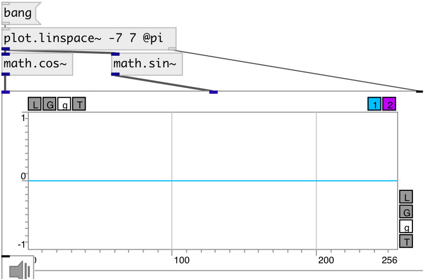

[index](index.html) :: [math](category_math.html)
---

# math.cos~

###### cosine function

*available since version:* 0.9

---

## information
Computes the cosine of input signal (in radians)

## inlets:

* input signal 
_type:_ audio

## outlets:

* result signal 
_type:_ audio

## keywords:

[math](keywords/math.html)
[cos](keywords/cos.html)

**See also:**
[\[math.cos\]](math.cos.html)
[\[math.sin~\]](math.sin~.html)

**Authors:** Serge Poltavsky

**License:** GPL3 or later

