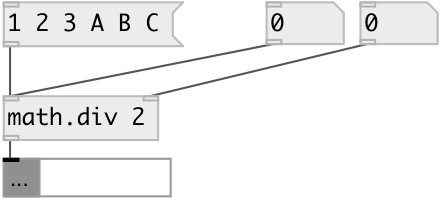

[index](index.html) :: [math](category_math.html)
---

# math.div
**aliases:** [math./]

###### division (on lists too)

*available since version:* 0.6

---

## arguments:

* **DIV**
divisor 
_type:_ float 

## properties:

* **@div** 
Get/set divisor 
_type:_ float 
_default:_ 1 

## inlets:

* divident 
_type:_ control
* change divisor 
_type:_ control

## outlets:

* float or list 
_type:_ control

## keywords:

[math](keywords/math.html)
[divide](keywords/divide.html)

**Authors:** Serge Poltavsky

**License:** GPL3 or later

