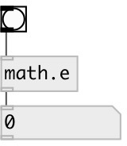

[index](index.html) :: [math](category_math.html)
---

# math.e

###### mathematical constant, base of the natural logarithm

*available since version:* 0.1

---

## information
It is approximately equal to 2.71828, and is the limit of (1 + 1/n)^n as n
            approaches infinity.

## inlets:

* outputs value 
_type:_ control

## outlets:

* output value 
_type:_ control

## keywords:

[math](keywords/math.html)
[e](keywords/e.html)

**See also:**
[\[math.pi\]](math.pi.html)

**Authors:** Serge Poltavsky

**License:** GPL3 or later

